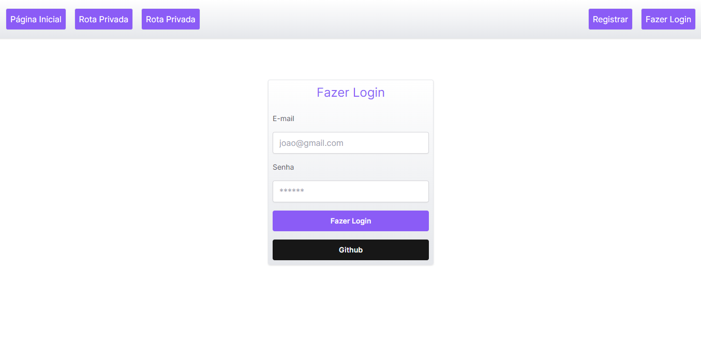
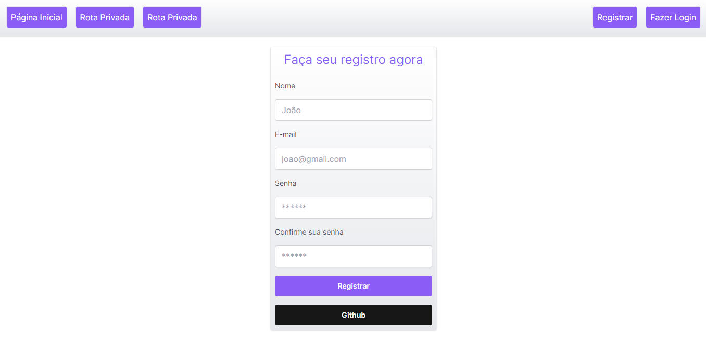
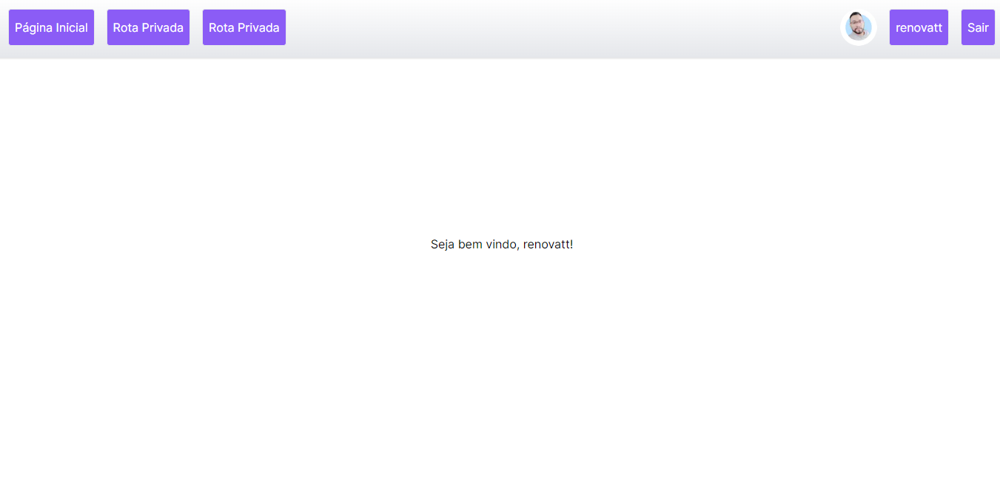

#

<h1>Next-Auth   

Login usando Next-Auth

</h1>

## Descrição

[Ver Projeto](https://next-auth-with-next13.vercel.app/)

#### Pequeno projeto fullstack usando [next-auth](https://next-auth.js.org/) como autenticação de login na versão Next.js 13.4, usando SQLite como banco de dados, JWT e bcrypt.

#

<!-- 

#

## _Layout Mobile_

#

## _Layout Web_

#

#

#

# -->

## 🛠️ Tecnologias

💻 **Front-end**
- [Next.js 13.4](https://nextjs.org)
- [TypeScript](https://www.typescriptlang.org)

📚 **Bibliotecas**
- [next-auth](https://next-auth.js.org/)
- [jsonwebtoken](https://jwt.io/)
- [bcrypt](https://www.npmjs.com/package/bcrypt)
- [react-icons](https://react-icons.github.io/react-icons)
- [react-toastify](https://www.npmjs.com/package/react-toastify)

📁 **Back-end**
- [Prisma](https://www.prisma.io)
- [Node.js](https://nodejs.org)
- [SQLite](https://www.sqlite.org/index.html)

🎨 **Estilização**
- [tailwindcss](https://tailwindcss.com/docs/installation)

🔋 **Versionamento e Deploy**
- [Git](https://git-scm.com)
- [Vercel](https://vercel.com/)

 

⚙️ **Configuranções e Instalações**

Clone do Projeto

    $ git clone https://github.com/renovatt/next-auth-with-next13.git

Instalando as dependências

    $ npm install

Iniciando o projeto

    $ npm run dev

 

**Como contribuir?**

- Você pode dar suporte me seguindo aqui no GitHub
- Dando uma estrela no projeto
- Criar uma conexão comigo no linkedin fazendo parte da minha networking e curtir o meu projeto.

 

**Autor**
[Wildemberg Renovato de Lima](https://www.linkedin.com/in/renovatt/)